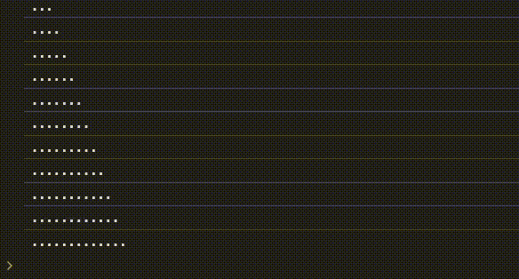

[//]: # ""

<p align="center">
  
  
</p>

---

# log-tags

Set of tools that help to add color tags to your console logs.

Typescript, es module, configurable, tree-shakable. [Generated typedoc reference](https://github.com/n1kk/console-log-tag).



## Install

```bash
# with npm
npm install log-tags
# with yarn
yarn add log-tags
# with pnpm
pnpm i log-tags
```

## Usage

```ts
// import what you need from the package
import { logtag, taggedLogger, tlog, installTaggedLogger, mergeTags } from "log-tags";

// you can create a standalone tag
const appTag = logtag("app");
// tags need to be spread into console for styles to be picked up
console.log(...appTag, "starting"); // -> [App] starting
// read below for moew info on colors and styles

// you CAN'T use two tags in a console, the styles won't be recognozed
console.log(...appTag, ...logtag("SubLog"), "initializing"); // [App] %cSubLog {_CSS_STRING_} initializing

// you can use supplied 'tlog' utility to merge all the tags into one declaration
tlog(appTag, logtag("SubLog"), "initializing"); // [App] [SubLog] initializing

// You create a tagged logger.ts
const systemLog = taggedLogger("System");
systemLog("loading"); // [System] loading

// tagged loggers have internal method to create child loggers
const subSystemA = systemLog.logger("Subsystem A");
subSystemA("processing"); // [System] [Subsystem A] processing

// if you want to log multiple tags in your own logging library there is a tool to merge tags together
const allTags = mergeTags(logtag("tag-1"), logtag("tag-2"));
console.log(...allTags, "completed"); // [tag-1] [tag-2] completed
```

`logtag` accepst a hex bg color or a CSS object as a second argument. If color is not passed then a unique color is generated for the string, the color is not random and is going to be the same for the same string, so even after app restart tags with same name will have same color. The color of the text is selected automatically based on the biggest contrast with background color. See Typedoc reference for signatures. CSS object allows configuring tags appearance, see allowed css fields in [MDN docs](https://developer.mozilla.org/en-US/docs/Web/API/console#outputting_text_to_the_console) and in [typedoc declarations](https://github.com/n1kk/console-log-tag).

#### Caveats

Tags are using consoles string substitution which means that it won't be available for you. You can still use string templates in your logs.
